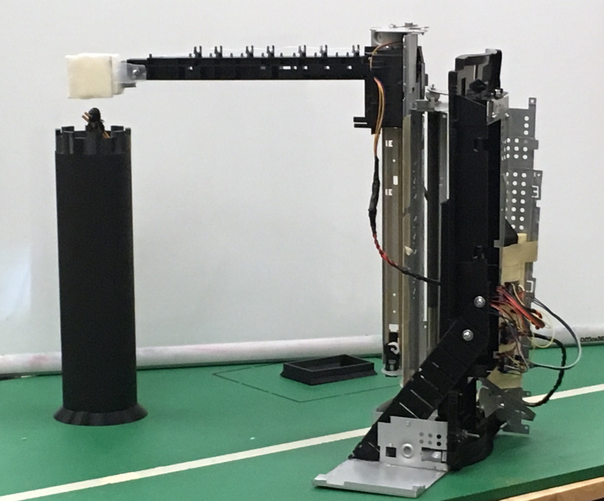

# print-carriage-hack
Retrospective of a Senior engineering challenge group project.

## Project Summary

Tasked with transporting a Lego minifig from the top of a small tower safely to the ground, our team built an electromechanical device from an old inkjet printer.  

The printer's chassis was hacked up and repurposed into a crane.  Controlled by an Arduino Uno, this monstrosity took advantage of the printer's stepper motors and print carriage to rotate horizontally, translate vertically, and grab the captive toy soldier.  The compliant felt pads (originally used to clean the printhead) were used to create a soft clamping system built on a living hinge.  

